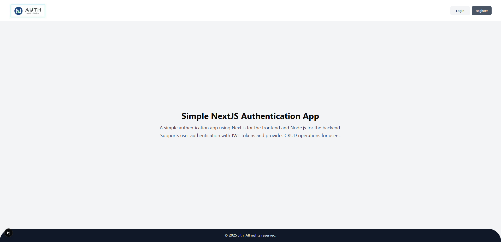
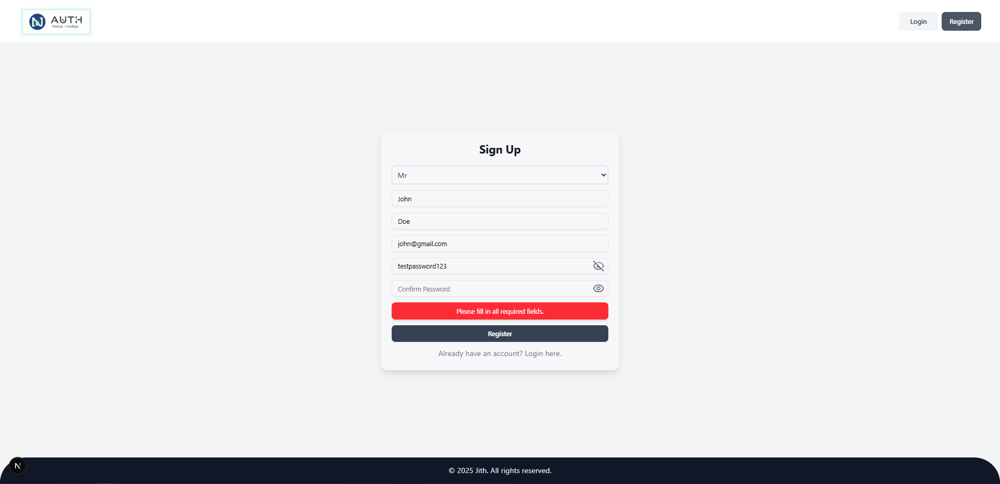
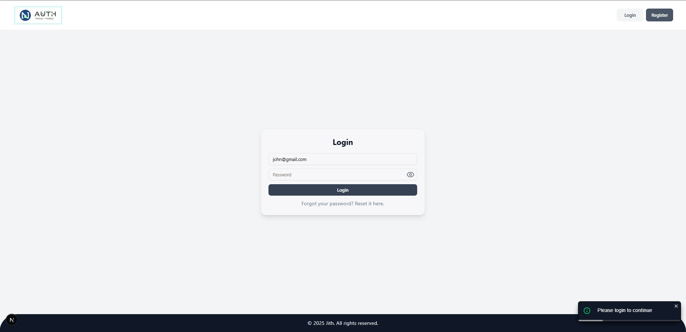
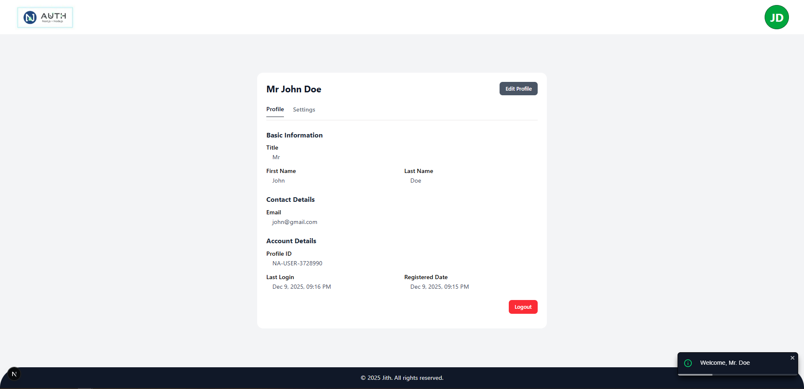
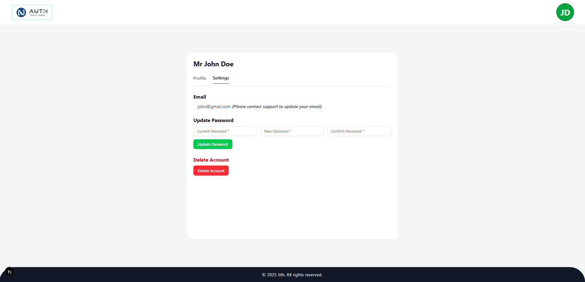
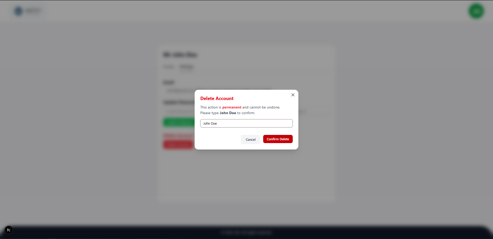

<div align="center">
  <h1="center">NextJS Authentication Application</h1>
</div>








### The NextJS Authentication App is a full-stack authentication solution developed as part of modern web security implementation, featuring secure user authentication, JWT-based session management, and protected route enforcement.

### This project demonstrates advanced NextJS patterns with server-side rendering, API route organization, and responsive UI components built with Tailwind CSS. The architecture emphasizes security with bcrypt password hashing, middleware-based authorization, and comprehensive form validation, while maintaining scalability through modular service layers and reusable React hooks.

### The application provides a production-ready authentication foundation suitable for enterprise applications, showcasing robust error handling, and state management with Redux.

- [![Next JS][Next.js]][Next-url]
- [![TailwindCss][TailwindCss]][Tailwind-url]
- [![Node][Node.js]][Node-url]
- [![Express][Express.js]][Express.js-url]
- [![PostgreSQL][PostgreSQL]][PostgreSQL-url]
- [![Sequelize][Sequelize]][Sequelize-url]

## Getting started

### Prerequisites

- node.js: [Node.js download page](https://nodejs.org/en/download)

### Installation

1. Clone the repo
   ```bash
   git clone https://github.com/CharakaJith/next-authentication-app.git
   ```
2. Step into the project
   ```bash
   cd next-authentication-app
   ```

### Environment variables setup

#### Server side

1. Create a `.env.dev` file in root folder
   ```
   New-Item -Path . -Name ".env.dev" -ItemType "File"
   ```
2. Open the `.env.dev` file and update the variables

   ```
   ## environment variables
   ENV=development
   PORT=8000 (make sure the port is set to 8000 for the development)

   ## database configurations
   PG_USER=<database user>
   PG_PASSWORD=<user password>
   PG_HOST=<database host>
   PG_DATABASE=<database name>
   PG_MAXCONN=150

   ## jwt secrets
   ACCESS_TOKEN_SECRET=<secure random string>
   REFRESH_TOKEN_SECRET=<secure random string>

   ## front-end url
   FRONTEND_URL=http://localhost:3000
   ```

#### Notes

- **For JWT secrets:** The <secure random string> values for `ACCESS_TOKEN_SECRET` and `REFRESH_TOKEN_SECRET` should be generated securely, for example using crypto.randomBytes in Node.js or a trusted online generator.

### Start the project using terminal

1. Install NPM packages
   ```bash
   npm run install:all
   ```
2. Create database tables
   ```bash
   npm run migrate:dev
   ```
3. Start the server and client
   ```bash
   npm run start
   ```

### Other scripts

1. Start the development server
   ```bash
   npm run dev
   ```
2. Start the client
   ```bash
   npm run client
   ```
3. Undo the last migration
   ```
   npm run migrate:dev:down
   ```
4. Undo all migrations
   ```
   npm run migrate:dev:down:all
   ```

## Assumptions

The following assumptions were made during the development of this project:

### 1. Environment Configuration

- The application runs in a Node.js environment (version 20.18.1).
- Environment variables are provided in a `.env.dev` file.
- The app uses `NODE_ENV=development` and `PORT=8000` for development.

### 2. Database

- **PostgreSQL** is used as the primary database for this project, providing a robust, ACID-compliant relational database solution suitable for secure authentication systems.
- The database contains two main tables: **User** and **BlacklistedToken**, with relationships managed through foreign key constraints.
- **User table**
  - Stores comprehensive user information including authentication credentials, profile data, and account metadata.
  - Each user is uniquely identified by a UUID and includes displayId for user-friendly identification.
  - Supports user status tracking (active/inactive) and maintains login timestamps for security monitoring.
  - Enforces data integrity with ENUM constraints for title (Mr., Mrs., Ms., etc.) and status fields.
- **BlacklistedToken table**
  - Manages invalidated JWT tokens to prevent token reuse after logout or expiration.
  - Maintains relationship with User table through foreign key reference for token ownership tracking.
  - Stores token expiration timestamps for automated cleanup of expired tokens.
  - Serves as a critical security component for stateless authentication systems.
- **Sequelize** is used as the ORM to interact with **PostgreSQL**.
  - Provides model definitions with proper data types, constraints, and validations.
  - Implements associations between models (User ↔ BlacklistedToken) with foreign key relationships.
  - Supports automatic timestamp management and UUID generation for primary keys.
  - Enables migrations and seeders for consistent database schema management across environments.

### 3. Authentication & Security

- Passwords are hashed securely (e.g., using bcrypt) before being stored in the database.
- User authentication is handled using **JSON Web Tokens (JWT)**, which are issued upon successful login and validated on protected routes.
- Users cannot update other users' details and see order details that does not belong to them.

### 4. User Roles & Access

- Only authenticated users can access protected endpoints.
- No admin or multi-tier access roles are implemented.

### 5. Request & Response Handling

- Client requests are expected to be well-formed and follow the defined API contract.
- Errors are handled using appropriate HTTP status codes and clear response messages.

### 6. Logging

- The application uses **Winston** for logging, with log files rotating daily.
- Logs include details about HTTP requests, response status, and error messages.
- The log format includes timestamps, log levels, and structured JSON data.
- Error stack traces are logged only in development mode.
- Sensitive information is not logged.
- Logs are kept for **14 days** before being automatically deleted.

### 7. Error Handling

- The application uses a custom error handler to manage errors and send appropriate responses.
- Errors are logged using **Winston** with the log type depending on the error severity (`ERROR`, `FAIL`).
- The error handler responds with an appropriate HTTP status code and error message.
- In development mode, the full stack trace is included in the response for debugging purposes.
- Sensitive error details (like passwords or tokens) are not included in the logs or responses.

### 8. Architecture

- The application follows a layered architecture with the following structure:

  - **Client**: The front-end that interacts with the API.
  - **Middleware**: Handles authentication, authorization, and request validation using Zod schemas before reaching route handlers.
  - **Route**: Defines the HTTP routes and endpoints exposed to the client.
  - **Controller**: Handles incoming requests and delegates business logic to services.
  - **Service**: Contains the core business logic and operations.
  - **Repository / Data access layer**: Provides an abstraction layer for interacting with the database.
  - **Database**: The PostgreSQL db database is used for storing and managing data.

## Identified Future Enhancements

- **Client-side**

  - **Social authentication**: Enable login via OAuth providers like Google, GitHub, and Facebook.
  - **Multi-Factor authentication**: Add optional two-factor authentication via SMS or authenticator apps.
  - **Password strength meter**: Provide real-time feedback on password strength during registration.
  - **Remember me option**: Add persistent session feature for trusted devices.

- **Server-side**

  - **Refresh token implementation**: Add secure token rotation mechanism with automatic refresh for extended user sessions.
  - **Rate limiting & security**: Implement IP-based rate limiting and advanced threat detection to prevent brute-force attacks.
  - **Email service integration**: Add comprehensive email verification, password reset, and security notification system.
  - **Docker containerization**: Containerize the application with Docker for consistent deployment across environments and simplified scaling.
  - **Load balancing**: Implement horizontal scaling with load balancing for high-availability production deployment.

### Declaration

- This project, including all source code and documentation, was developed by me as part of my Next.js skill demonstration to showcase modern full-stack development capabilities.
- Product descriptions and documentation were reviewed and refined using ChatGPT to ensure proper grammar, clarity, and professional English.
- ChatGPT was used as a guidance for UI component styling (CSS) and layout decisions. All backend functionality, including API implementation, database interactions, and business logic, as well as the thought process was independently concluded by the author.

## Documentations

- [Postman API documentation](https://documenter.getpostman.com/view/28014836/2sB3dSP8FG)

## Contact

Email: [gunasinghe.info@gmail.com](mailto:gunasinghe.info@gmail.com) | LinkedIn: [Charaka Jith Gunasinghe](https://www.linkedin.com/in/charaka-gunasinghe/)

<!-- MARKDOWN LINKS & IMAGES -->

[Next.js]: https://img.shields.io/badge/Next-black?style=for-the-badge&logo=next.js&logoColor=white
[Next-url]: https://nextjs.org/
[TailwindCss]: https://img.shields.io/badge/Tailwind_CSS-06B6D4?style=for-the-badge&logo=tailwind-css&logoColor=white
[Tailwind-url]: https://tailwindcss.com/
[Node.js]: https://img.shields.io/badge/Node.js-12A952?style=for-the-badge&logo=node.js&logoColor=white
[Node-url]: https://nodejs.org/en
[Express.js]: https://img.shields.io/badge/Express.js-000000?style=for-the-badge&logo=express&logoColor=white
[Express.js-url]: https://expressjs.com/
[PostgreSQL]: https://img.shields.io/badge/PostgreSQL-316192?style=for-the-badge&logo=postgresql&logoColor=white
[PostgreSQL-url]: https://www.postgresql.org/
[Sequelize]: https://img.shields.io/badge/Sequelize-52B0E7?style=for-the-badge&logo=Sequelize&logoColor=white
[Sequelize-url]: https://sequelize.org/
